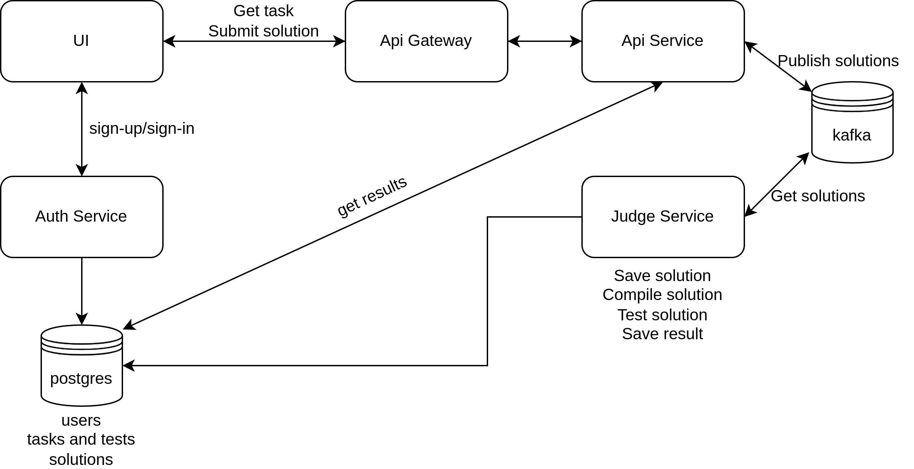

# HLD

Предлагается брать за основу opensource решение [jalgoarena](https://jalgoarena.github.io/).

## UI

1. Админ панель - регистрация кабинета соискателя, выдача ему задания, получение результатов
2. Вход для соискателя 
3. Редактор кода
4. Отслеживание времени выполнения задания

## Auth Service

1. Регистрация соискателей и управление ими
2. Выдача JWT токенов

## Api Service

1. Получение задания для соискателя
2. Загрузка решения (пуш в kafka топик)
3. Получение результата (для админа)

## Judje Service

1. Получение решений соискателя (прослушивание kafka топика)
2. Сохранение решения в postgres
3. Компиляция решения
4. Запуск тестов
5. Сохранение результатов компиляции и тестирования
